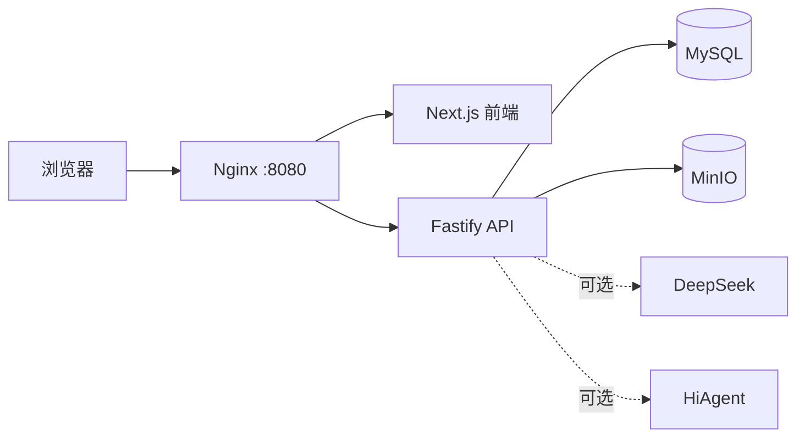

# AI-X Personalized Learning

<p align="center">
  <strong>让课程围绕学习者的目标重新连接。</strong><br>
  一个可在本地完整运行的个性化学习平台：从兴趣与目标出发，生成学习路径，陪伴真实实践，并留下可回顾的学习证据。
</p>

<p align="center">
  <a href="README_EN.md">English</a> ·
  <a href="https://xiaoyu8758.github.io/AI-X-personalized-learning-platform/">项目展示与团队</a> ·
  <a href="docs/getting-started.zh-CN.md">完整安装指南</a> ·
  <a href="docs/configuration.zh-CN.md">配置与 API Key</a> ·
  <a href="CONTRIBUTING.md">参与贡献</a>
</p>

<p align="center">
  
  
  
  
</p>


## 项目展示与团队

AI-X 不只是一份可以在本地运行的开源代码，也是一项围绕个性化学习、智能导师与可信学习证据展开的教学创新实践。

在项目展示页中，你可以了解课程背景、整体方案、系统架构、团队成员与分工，以及从构想到落地的阶段性成果。

**[查看 AI-X 项目展示页 →](https://xiaoyu8758.github.io/AI-X-personalized-learning-platform/)**

**[认识项目团队 →](https://xiaoyu8758.github.io/AI-X-personalized-learning-platform/#team)**

## 学习，不必从目录开始

传统课程先给出一套固定顺序，再要求每个人从第一页走到最后一页。AI-X 选择从另一个问题开始：**你真正想做成什么？**

学习者可以输入自己的兴趣、方向与目标。平台会把已有课程内容重新组织成一条可执行的个人路径：每一步都有目标、检查清单、安全边界、完成标准和学习资源。Quiz 与证据链记录不只回答“学过没有”，还帮助学习者理解“下一步应该去哪里”。

## 你可以用它做什么

| 能力 | 平台中的体验 |
| --- | --- |
| 个性化路径 | 从兴趣和目标出发，匹配已有课程并组织学习顺序 |
| 步骤式学习 | 把课程转换为可执行任务、检查清单、安全提醒与完成标准 |
| 学习伙伴 | 根据当前课程与阶段提供上下文化帮助；未配置 AI 时自动使用后端降级回复 |
| 课程 Quiz | 从本地课程与步骤生成小练习、评分并给出后续建议 |
| 过程证据 | 保存学习进度、回答、作品与活动记录，形成可回顾的过程 |
| 中英文界面 | 支持中英文学习界面；外部模型可进一步增强动态翻译 |
| 本地数据控制 | MySQL 保存结构化数据，MinIO 保存学习证据，数据默认留在你的 Docker 卷中 |

## 看看它如何工作

### 1. 把兴趣变成一条路径


### 2. 把路径变成可执行的步骤


### 3. 用 Quiz 与证据回看学习结果


## 在本地运行

你只需要 [Docker Desktop](https://www.docker.com/products/docker-desktop/) 或带有 Docker Compose v2 的 Docker Engine。第三方 AI Key **不是启动平台的前提**。

```bash
cp .env.example .env
docker compose up --build -d
```

容器就绪后打开：

```text
http://localhost:8080/personalized-secure/
```

首次使用时选择“注册”创建一个本地账号，不存在预设的公开学生账号。

> `.env.example` 中的 MySQL、MinIO 和 JWT 值只适用于隔离的本地体验。如果计算机会被其他人访问，请在启动前替换它们。

需要 Windows 命令、健康检查、日志查看、数据保留和完整排错方法，请阅读 [完整安装指南](docs/getting-started.zh-CN.md)。

## 没有 AI API Key 时会怎样？

Community 版本不包含任何真实的第三方密钥。这是有意的安全边界，不是一个启动缺陷。

**不填 Key 也能使用：**

- 注册、登录和本地用户数据；
- 兴趣选择、个性化路径与课程步骤；
- 课程资源、进度、证据上传与回顾；
- 基于本地课程内容的 Quiz、评分与推荐；
- 规则型数字分身概要和学习伙伴降级回复。

**填入自己的 Key 后才会启用：**

- `DEEPSEEK_API_KEY`：实时数字分身对话和部分动态英文翻译；
- `AGENT_PROVIDER_URL` 与 HiAgent AppKey：真实的课程学习伙伴调用。

请在本地 `.env` 中填写它们，永远不要将 `.env` 提交到 Git。变量用途与安全要求见 [配置与 API Key](docs/configuration.zh-CN.md)。

## 系统组成



默认只将 Nginx 入口映射到主机；MySQL、MinIO、前端服务和 API 均留在 Compose 内部网络。详细说明见 [系统架构](docs/architecture.zh-CN.md)。

## 仓库导览

```text
apps/
├── frontend/              # Next.js 学习界面
└── backend/               # Fastify API、数据库结构与测试
content/course-assets/       # 平台实际引用的课程资源
infrastructure/              # 本地 Nginx 与初始化配置
assets/screenshots/          # README 产品截图
docs/                        # 安装、配置、架构与来源说明
docker-compose.yml           # 一体化本地运行入口
```

## 文档

- [完整安装指南](docs/getting-started.zh-CN.md) / [Getting started](docs/getting-started.en.md)
- [配置与 API Key](docs/configuration.zh-CN.md) / [Configuration and API keys](docs/configuration.en.md)
- [系统架构](docs/architecture.zh-CN.md) / [Architecture](docs/architecture.en.md)
- [贡献指南](CONTRIBUTING.md)
- [安全策略](SECURITY.md)
- [社区行为准则](CODE_OF_CONDUCT.md)
- [源码与资源来源](docs/source-provenance.md)
- [第三方依赖许可证说明](THIRD_PARTY_NOTICES.md)

## 参与社区

我们欢迎将它用于课堂、项目式学习和教育技术研究，也欢迎修复问题、改善体验、补充测试或贡献新的课程资源。开始前请阅读 [CONTRIBUTING.md](CONTRIBUTING.md)和 [CODE_OF_CONDUCT.md](CODE_OF_CONDUCT.md)。

如果问题涉及漏洞、密钥或真实用户数据，请不要创建公开 Issue，按 [SECURITY.md](SECURITY.md) 私下报告。

## License

本项目以 [MIT License](LICENSE) 开源。第三方依赖保留各自许可证，详见 [第三方依赖许可证说明](THIRD_PARTY_NOTICES.md)；仓库中标注了单独来源或许可证的资源，以其各自文件中的说明为准。
