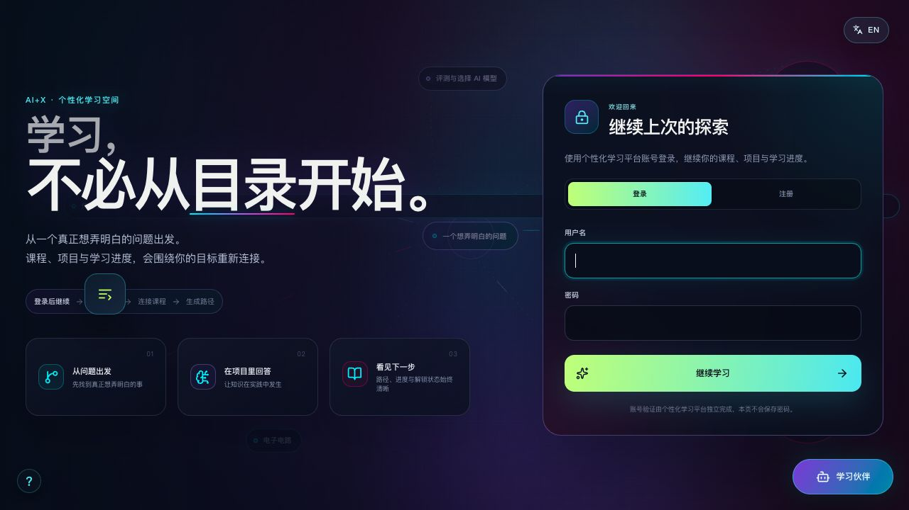
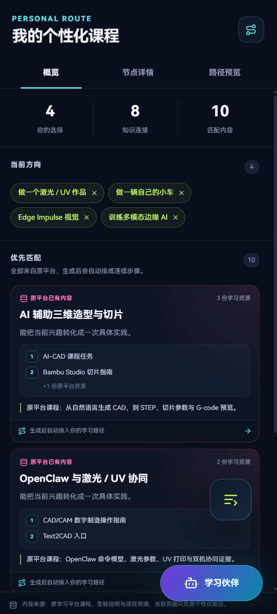
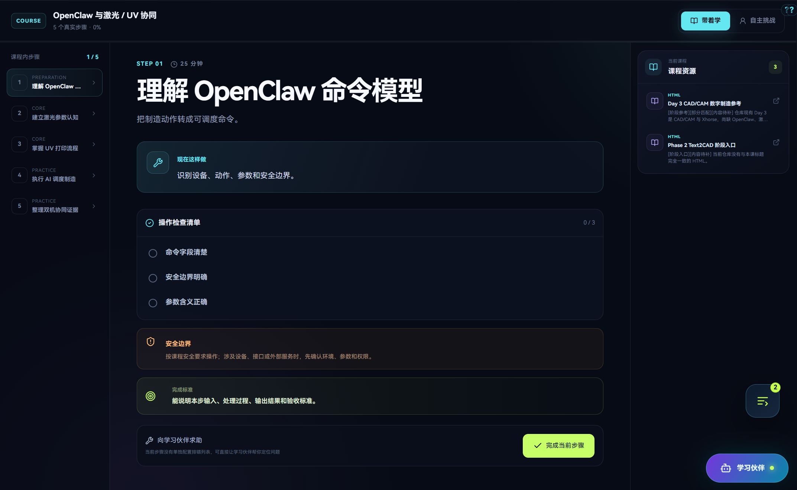
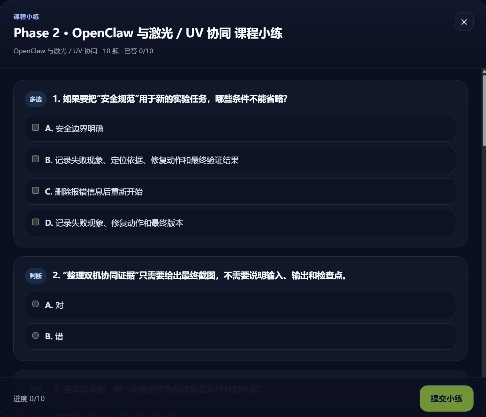
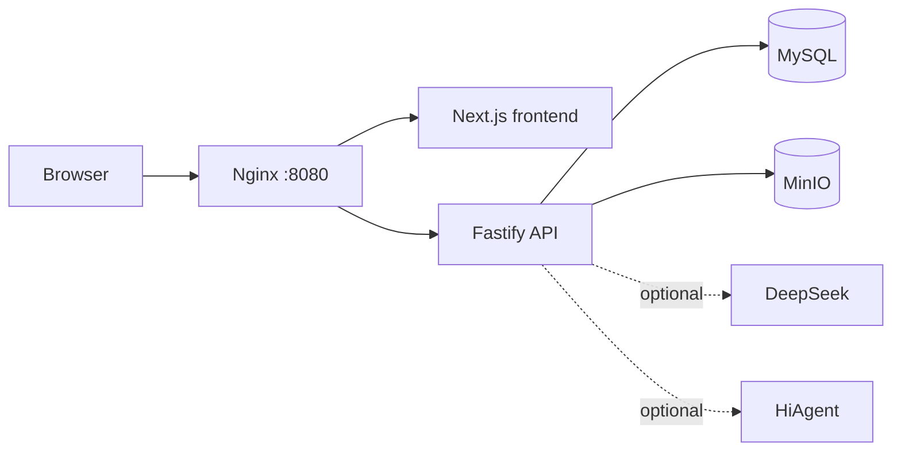

# AI-X Personalized Learning

<p align="center">
  <strong>Reconnect a curriculum around the learner's goals.</strong><br>
  A complete, locally runnable personalized learning platform that turns interests into learning routes, routes into practical steps, and learning activities into evidence learners can revisit.
</p>

<p align="center">
  <a href="README.md">中文</a> ·
  <a href="https://xiaoyu8758.github.io/AI-X-personalized-learning-platform/">Project showcase &amp; team</a> ·
  <a href="docs/getting-started.en.md">Full setup guide</a> ·
  <a href="docs/configuration.en.md">Configuration and API keys</a> ·
  <a href="CONTRIBUTING.md">Contributing</a>
</p>

<p align="center">
  
  
  
  
</p>



## Project showcase and team

AI-X is more than a locally runnable open-source codebase. It is an educational innovation project exploring personalized learning, AI mentorship, and trustworthy learning evidence.

Visit the project showcase to learn about the educational context, overall solution, system architecture, team responsibilities, and milestones from concept to implementation.

**[Explore the AI-X project →](https://xiaoyu8758.github.io/AI-X-personalized-learning-platform/)**

**[Meet the team →](https://xiaoyu8758.github.io/AI-X-personalized-learning-platform/#team)**

## Learning does not have to begin with a catalogue

Traditional courses start with a fixed sequence and ask every learner to travel from the first page to the last. AI-X begins with a different question: **what do you genuinely want to make, understand, or become?**

Learners describe their interests, direction, and goals. The platform reconnects existing course material into a personal route they can act on. Each step carries a goal, checklist, safety boundary, completion standard, and relevant learning resources. Quizzes and the evidence chain go beyond recording whether something was completed: they help learners understand what to do next.

## What you can do

| Capability | Experience in the platform |
| --- | --- |
| Personalized routes | Match existing courses to a learner's interests and arrange them into a useful order |
| Step-by-step learning | Turn courses into actionable tasks, checklists, safety notes, and completion criteria |
| Learning companion | Offer help grounded in the current phase and course, with a backend fallback when no AI provider is configured |
| Course quizzes | Build, score, and recommend follow-up practice from local course and step content |
| Learning evidence | Keep progress, answers, artifacts, and activity records as a reviewable learning history |
| Chinese and English UI | Provide a bilingual learning interface, with optional model-assisted dynamic translation |
| Local data control | Keep structured data in MySQL and evidence objects in MinIO-backed Docker volumes |

## See the learning journey

### 1. Turn interests into a route



### 2. Turn the route into actionable steps



### 3. Revisit learning through quizzes and evidence



## Run it locally

You only need [Docker Desktop](https://www.docker.com/products/docker-desktop/) or Docker Engine with Docker Compose v2. Third-party AI keys are **not required to start the platform**.

```bash
cp .env.example .env
docker compose up --build -d
```

When the containers are ready, open:

```text
http://localhost:8080/personalized-secure/
```

Choose **Register** on first use to create a local account. The project does not ship a public preset student account.

> The MySQL, MinIO, and JWT values in `.env.example` are examples for an isolated local machine only. Replace them before allowing anyone else to reach the service.

For Windows commands, health checks, logs, persistent data, updates, and troubleshooting, read the [full setup guide](docs/getting-started.en.md).

## What happens without AI API keys?

The Community edition contains no real third-party credentials. That is an intentional security boundary, not a startup defect.

**Available without any external key:**

- registration, sign-in, and local user data;
- interest selection, personalized routes, and course steps;
- local learning resources, progress, evidence uploads, and review;
- quizzes, scoring, and recommendations generated from local course content;
- a rule-based digital-twin summary and the learning companion's backend fallback response.

**Enabled only after you add your own credentials:**

- `DEEPSEEK_API_KEY`: live digital-twin chat and some dynamic English translation;
- `AGENT_PROVIDER_URL` plus HiAgent AppKeys: live course-companion responses.

Put credentials in your local `.env` and never commit that file. See [Configuration and API keys](docs/configuration.en.md) for every variable and its security requirements.

## Architecture at a glance



Only the Nginx entry point is mapped to the host by default. MySQL, MinIO, the frontend service, and the API remain on the internal Compose network. Read [Architecture](docs/architecture.en.md) for details.

## Repository map

```text
apps/
├── frontend/              # Next.js learning interface
└── backend/               # Fastify API, database schemas, and tests
content/course-assets/       # Course resources referenced by the platform
infrastructure/              # Local Nginx and initialization configuration
assets/screenshots/          # Product images used by this README
docs/                        # Setup, configuration, architecture, and provenance
docker-compose.yml           # Complete local entry point
```

## Documentation

- [完整安装指南](docs/getting-started.zh-CN.md) / [Getting started](docs/getting-started.en.md)
- [配置与 API Key](docs/configuration.zh-CN.md) / [Configuration and API keys](docs/configuration.en.md)
- [系统架构](docs/architecture.zh-CN.md) / [Architecture](docs/architecture.en.md)
- [Contributing](CONTRIBUTING.md)
- [Security policy](SECURITY.md)
- [Community Code of Conduct](CODE_OF_CONDUCT.md)
- [Source and asset provenance](docs/source-provenance.md)
- [Third-party dependency notices](THIRD_PARTY_NOTICES.md)

## Join the community

Use AI-X in a classroom, project-based learning programme, or educational-technology study. Contributions that fix problems, improve the experience, add tests, or bring well-licensed learning resources are welcome. Read [CONTRIBUTING.md](CONTRIBUTING.md) and [CODE_OF_CONDUCT.md](CODE_OF_CONDUCT.md) before starting.

Do not open a public issue for vulnerabilities, exposed credentials, or real user data. Follow [SECURITY.md](SECURITY.md) to report them privately.

## License

This project is released under the [MIT License](LICENSE). Third-party dependencies retain their own terms as described in [Third-party dependency notices](THIRD_PARTY_NOTICES.md); assets that carry a separate source or licence notice remain subject to the notice in their own files.
