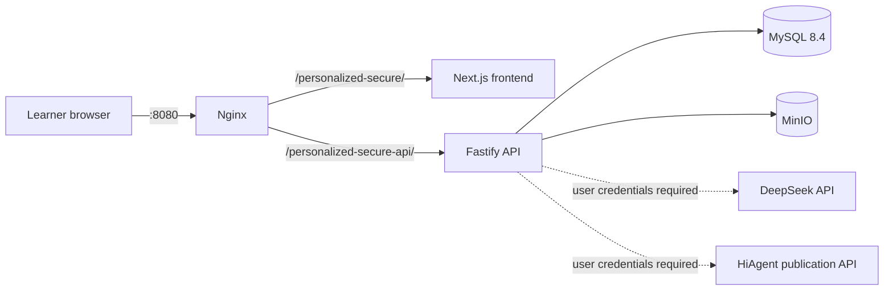
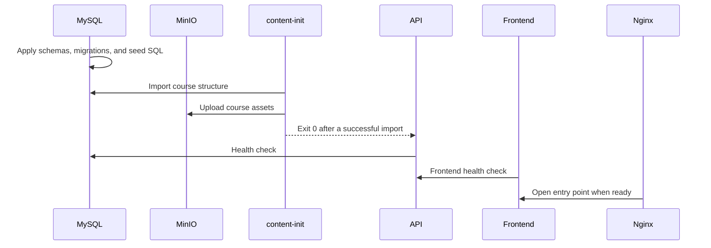

# Architecture

[中文](architecture.zh-CN.md) · [Back to README](../README_EN.md)

AI-X Community is a single-host learning platform delivered with Docker Compose. It combines the browser experience, application API, structured data, and learning-evidence storage in one repeatable local environment.

## Request path

Nginx is the only service mapped to the host by default. All other services communicate through Compose's internal DNS and network.

## Services and responsibilities

| Compose service | Implementation | Responsibility | Host exposure |
| --- | --- | --- | --- |
| `nginx` | Nginx 1.28 Alpine | Single entry point, routing, gzip, and static-cache policy | `${PERSONALIZED_SECURE_PORT:-8080}` |
| `frontend` | Next.js 16 / React 19 | Sign-in, personalized routes, course steps, quizzes, and evidence interactions | None |
| `api` | Node.js / Fastify 5 | Authentication, learning data, routes, quizzes, evidence, memory, and the Agent gateway | None |
| `mysql` | MySQL 8.4 | Accounts, course structure, progress, quizzes, events, and evidence metadata | None |
| `minio` | MinIO | Object storage for evidence files and course assets | None |
| `content-init` | One-shot task using the backend image | Imports course JSON and local assets on startup | None |

## Routing boundary

| Public path | Target | Cache semantics |
| --- | --- | --- |
| `/personalized-secure/` | Next.js learning interface | HTML and runtime pages use `no-store` |
| `/personalized-secure/_next/static/` | Content-hashed Next.js assets | One-year `immutable` cache |
| `/personalized-secure-api/` | Fastify API | `no-store` |

MySQL, the MinIO API, the Next.js internal port, and the Fastify internal port have no host `ports` mapping.

## Startup and content initialization

`content-init` is not a long-running service. It exits with code 0 after a successful import; the API starts afterwards.

## Core learning data flow

1. **Identity and sessions:** learners register through the Fastify API. Passwords are hashed with Argon2id; access tokens are signed with the server-side JWT secret.
2. **Personalization input:** interests, learning preferences, and career direction are stored in MySQL.
3. **Route generation:** the backend combines that input with the local catalogue, competency map, and recommendation rules.
4. **Steps and progress:** the frontend reads course steps and sends checklist, completion, and activity events back to the API.
5. **Quizzes:** the backend builds questions from local course content and records answers, scores, weak tags, and follow-up recommendations.
6. **Evidence:** files are stored in MinIO; metadata, integrity information, and learning events are stored in MySQL.

## External AI boundary

Every external AI call originates from the backend. Credentials are read only from server-side environment variables. The frontend neither needs nor should receive a DeepSeek key or HiAgent AppKey.

- Without DeepSeek, affected features use rule-based fallbacks or report that the provider is not configured.
- Without HiAgent, the Agent gateway returns a fallback response and continues storing local learning records.

See [Configuration and API keys](configuration.en.md) for the exact variables.

## Persistence and backups

Compose creates two named volumes:

- `mysql-data`: accounts, learning structure, progress, quizzes, and evidence metadata;
- `minio-data`: uploaded evidence and imported course assets.

`docker compose down` keeps data; `docker compose down -v` deletes it. Before a shared deployment, define MySQL and MinIO backup, restore, and retention procedures appropriate for that environment.

## Development boundaries

- The root `docker-compose.yml` is the canonical Community delivery path.
- Production server addresses, SSH details, and environment snapshots do not belong in this repository.
- Database schema, route, or storage-contract changes should include migrations, tests, and backward-compatibility notes.
- Every added course asset must have a verified source and redistribution right.
