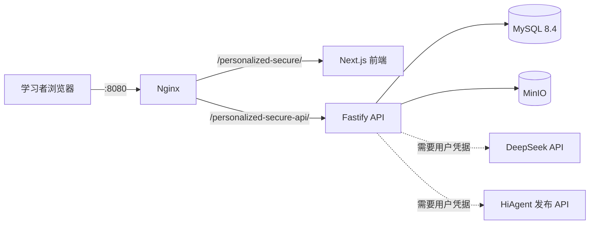
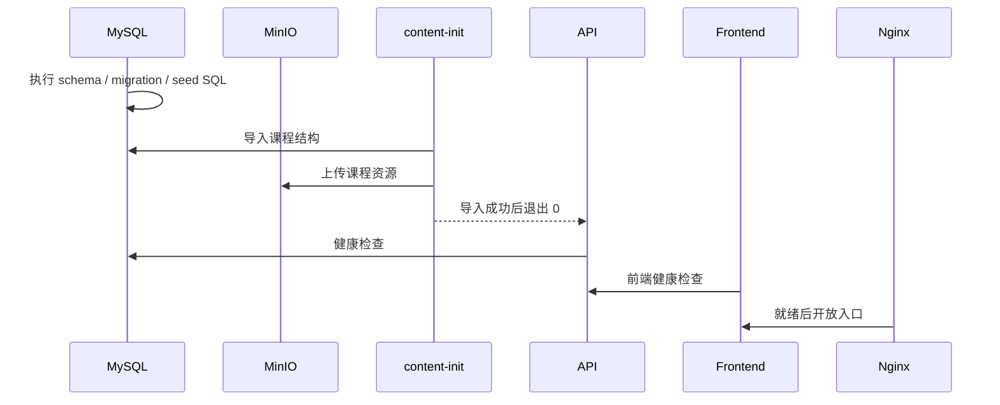

# 系统架构

[English](architecture.en.md) · [返回 README](../README.md)

AI-X Community 是一个以 Docker Compose 交付的单机学习平台。它将浏览器界面、业务 API、结构化数据和学习证据存储组合在一个可重复启动的本地环境中。

## 整体请求路径

Nginx 是默认唯一暴露到主机的服务。其他服务通过 Compose 内部 DNS 与网络互相访问。

## 服务与职责

| Compose 服务 | 实现 | 职责 | 主机暴露 |
| --- | --- | --- | --- |
| `nginx` | Nginx 1.28 Alpine | 单一入口、路径转发、gzip 和静态缓存策略 | `${PERSONALIZED_SECURE_PORT:-8080}` |
| `frontend` | Next.js 16 / React 19 | 登录界面、个性化路径、课程步骤、Quiz 和证据交互 | 否 |
| `api` | Node.js / Fastify 5 | 身份验证、学习数据、路径、Quiz、证据、记忆和 Agent 网关 | 否 |
| `mysql` | MySQL 8.4 | 账号、课程结构、进度、Quiz、事件与证据元数据 | 否 |
| `minio` | MinIO | 学习证据文件与课程资源对象存储 | 否 |
| `content-init` | 后端镜像的一次性任务 | 在首次启动时导入课程 JSON 与本地资源 | 否 |

## 路由边界

| 公开路径 | 目标 | 缓存语义 |
| --- | --- | --- |
| `/personalized-secure/` | Next.js 学习界面 | HTML 与运行时页面 `no-store` |
| `/personalized-secure/_next/static/` | Next.js 内容哈希静态资源 | 一年 `immutable` |
| `/personalized-secure-api/` | Fastify API | `no-store` |

MySQL、MinIO API、Next.js 内部端口和 Fastify 内部端口都没有通过 Compose `ports` 映射到主机。

## 启动与内容初始化

`content-init` 不是长期运行的服务。它成功导入后以 0 退出，API 会在此之后启动。

## 核心学习数据流

1. **身份与会话**：用户在 Fastify API 注册；密码使用 Argon2id 哈希，访问 Token 由服务端 JWT Secret 签发。
2. **个性化输入**：兴趣、学习偏好与职业方向写入 MySQL。
3. **路径生成**：后端将输入与本地课程目录、能力图谱和推荐规则组合为个人路径。
4. **步骤与进度**：前端读取课程步骤，将检查项、完成状态和学习事件写回 API。
5. **Quiz**：后端从本地课程内容构造题目，保存答题、评分、薄弱标签和后续建议。
6. **证据**：文件存入 MinIO，元数据、完整性信息和学习事件存入 MySQL。

## 外部 AI 边界

所有外部 AI 调用都从后端发起，凭据只从服务端环境变量读取。前端不需要也不应该获得 DeepSeek Key 或 HiAgent AppKey。

- DeepSeek 未配置时，相关功能使用规则型降级或明确返回未配置。
- HiAgent 未配置时，Agent 网关返回降级消息，并继续保存本地学习记录。

详细变量见 [配置与 API Key](configuration.zh-CN.md)。

## 数据持久化与备份

Compose 创建两个命名卷：

- `mysql-data`：账号、学习结构、进度、Quiz 和证据元数据；
- `minio-data`：上传证据与导入的课程资源。

`docker compose down` 保留数据，`docker compose down -v` 删除数据。公开部署前应建立与自身环境匹配的 MySQL 和 MinIO 备份、恢复与保留策略。

## 开发边界

- 核心交付路径是根目录 `docker-compose.yml`。
- 不应将生产服务器地址、SSH 信息或环境快照加入社区仓库。
- 任何数据库 schema、路由或存储契约变更都应包含迁移、测试和向后兼容说明。
- 向仓库添加课程资源时，必须确认来源与再分发权利。
